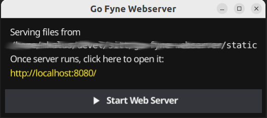

# Go Fyne Webserver

This is a simple static webserver with a GUI frontend to start and stop it. It is useful if you have a static website
to share with your customer and he or she does not have a webserver at hand. Just create a zip, with Go Fyne Webserver
in the root directory. Create a `static` folder which contains your static website. Run the binary and you will see
a window.



Press "Start Web Server" to start the server and point your browser to [http://localhost:8080/](http://localhost:8080/).


## Building

Install Fyne Cross:

```shell
go install github.com/fyne-io/fyne-cross@latest
```

You might need certain prerequisites on your machine, see:
[cross compiling section](https://developer.fyne.io/started/cross-compiling#compiling-from-a-development-computer) in
the Fyne docs.

Build for different platforms:

```shell
fyne-cross windows -arch=amd64,386
fyne-cross darwin -arch=amd64,arm54
fyne-cross linux -arch=amd64,386,arm64,arm
```

Note: If you want to build for OSX (Darwin), you have to build the darwin image first, as described on
[Fyne Cross' Github page](https://github.com/fyne-io/fyne-cross).


## Acknowledgements

Icon adapted from:

https://openmoji.org/library/emoji-1F9DE/

Icon designed by [OpenMoji](https://openmoji.org/) – the open-source emoji and icon project. License: CC BY-SA 4.0
